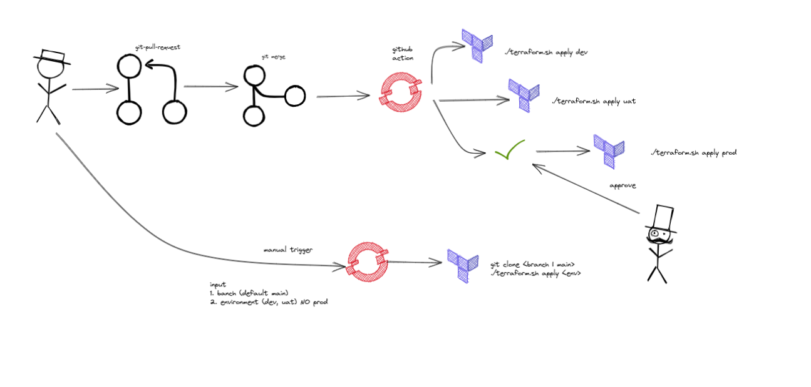
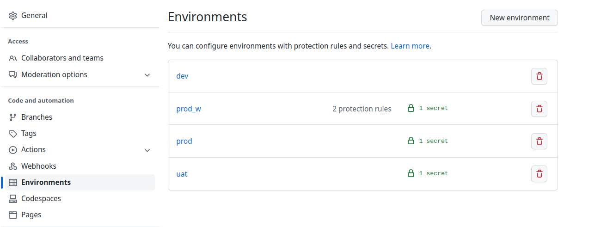
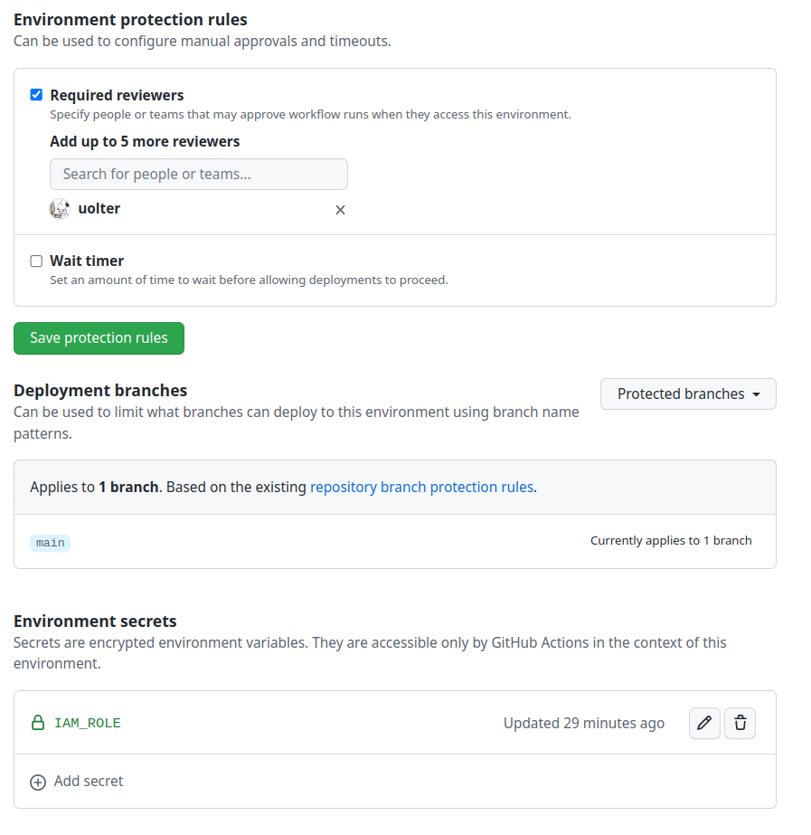

# Project Name
Template useful to create a AWS infrastructures with terraform


## Howo to use this template

1. Create your github repository starting form this template.
2. Configure your **aws cli** and set the [credentials](https://docs.aws.amazon.com/cli/latest/userguide/cli-configure-files.html). Also refer the confluence page to work with [AWS SSO](https://pagopa.atlassian.net/wiki/spaces/DEVOPS/pages/466846955/AWS+-+Users+groups+and+roles#SSO-with-GSuite).
3. The __./src/init__ directory contains the terraform code to setup the S3 backend, the Dynamodb lock table, github openid connection and the iam role to use in the github actions
4. The __./src/main__ directory cointains the terraform code to setup the core infrastructure.
5. The __.github/workflows__ directory contains two yaml files to run a terraform plan and apply actions. They need a github environment secret to be created: IAM_ROLE (see below.)

## Requirements

The following tools are required to setup the project locally. 

1. [aws cli](https://docs.aws.amazon.com/cli/latest/userguide/getting-started-install.html) installed.
2. [tfenv](https://github.com/tfutils/tfenv) to mange terraform versions.

## Start building

Create:

* The s3 bucket to store terraform state
* The Dynamodb table to manage terraform locks
* The Github OpenId connection

```bash
# init uat environment
cd src/init

./terraform.sh init uat

./terraform.sh apply uat

# create uat environment

cd ../../
cd src/main

./terraform.sh init uat

./terraform.sh apply uat
```

## Github actions

In the repository two github actions are already provided:

* **terraform-plan**: it runs every time new code is pushed in every branch excluded main and master. It runs terraform plan through all the environments in parallel.

* **terraform-apply**: it runs terraform apply in all the environments once a PR is merged with main.
  * The apply in PROD should require an approval: it depends on the Environment protection rules.
  * It can also be triggerd manually in all the environment expect main.





### Configurations

* Create [github environment](https://docs.github.com/en/actions/deployment/targeting-different-environments/using-environments-for-deployment) for every environments:**dev**, **uat**, **prod**, and **prod_w**.
* **prod_w** is like prod but it is meant to be used only in the apply action in production. 



* In each environment create a secret named **IAM_ROLE** and set its value with the **arn** of the role created at the very beginnig (init).
* Within **prod_w** set two **Environment protection rules** as shown in the screenshot below:


## Releases

New releases are created every time PR are merged with main. A github action is responsible to create the release and it relires on the title of the PR as described in the [official repository](https://github.com/cycjimmy/semantic-release-action)


## Referencees

* [Confluence page](https://pagopa.atlassian.net/wiki/spaces/DEVOPS/pages/467894592/AWS+Setup+new+project)
* [Terraform](https://terraform.io/)
* [Github action](https://docs.github.com/en/actions)
* [Configuring OpenID Connect in Amazon Web Services](https://docs.github.com/en/actions/deployment/security-hardening-your-deployments/configuring-openid-connect-in-amazon-web-services)